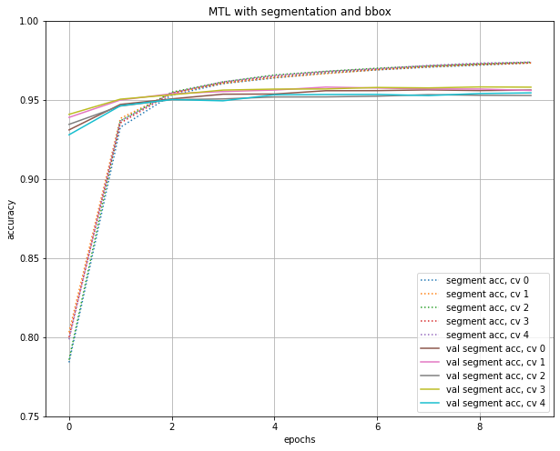

# COMP0090 - Introduction to Deep Learning - Coursework 2
#### Cross Validation results: 

  
   

  
   

#### Instructions:
- Clone/Download OxPet Dataset from https://weisslab.cs.ucl.ac.uk/WEISSTeaching/datasets/-/tree/oxpet/
- Put into /datasets folder within in the main working directory
#### Pip Modules:
 - Tensorflow
 - Scikit
 - Matplotlib
#### Group Members:  
- Mazin Abdulmahmood – Machine Learning
- Wing Chung Law – Robotics and Computation
- Ying-Lun Cheng – Machine Learning
- Myrto Konstantinidi – Machine Learning
- Fares Fawzi – Data Science and Machine Learning
- Rhys Semple - Scientific and data intensive computing
